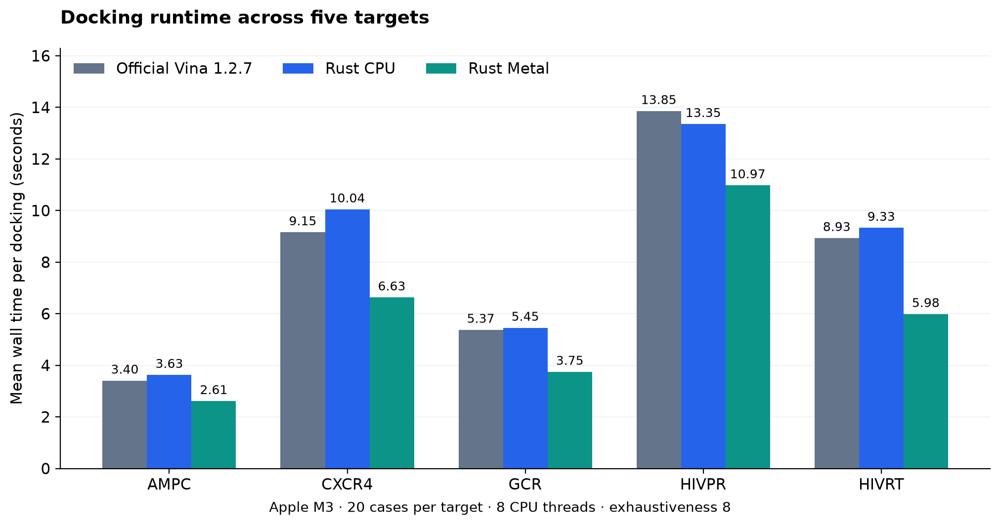
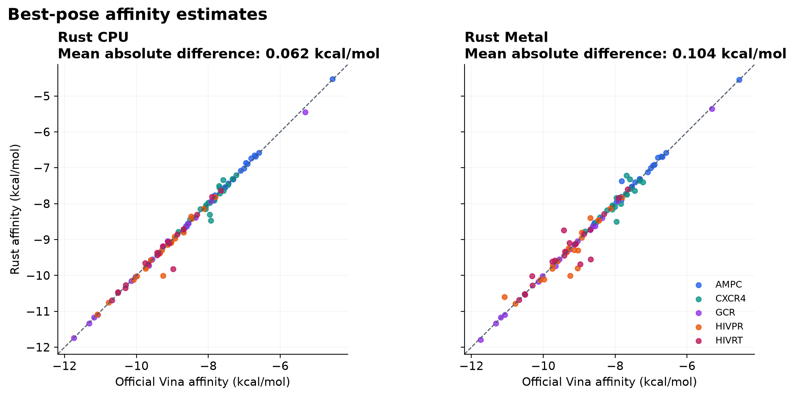
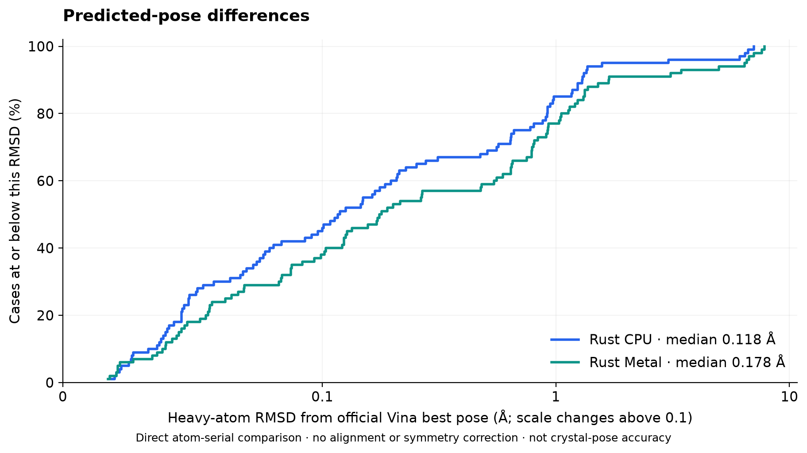

# RustDock Vina

Native Rust docking engine, CLI and Python interface based on the preserved AutoDock Vina source in `reference/`. Supports Vina, Vinardo and AutoDock4 scoring, PDBQT ligands and flexible residues, affinity maps, local optimization, CPU Monte Carlo docking and pose output. The docking engine runs independently of the official Vina executable; reference benchmarks use it for comparison.

## Measured 100-case benchmark

On the completed **2026-10-09 Apple M3 run**, Metal took **1.36× faster than official Vina by total wall time** (26.5% lower wall time) and was **1.40× faster than Rust CPU**. Rust CPU took 2.7% more total time than official Vina. Metal was faster than official Vina in 94 of 100 cases; Rust CPU was faster in 30.

The run includes 100 prepared ligand cases across AMPC, CXCR4, GCR, HIVPR and HIVRT, with 20 cases per target and **300 successful docking runs**. Some cases are different conformers of the same compound. Settings: eight CPU threads, exhaustiveness 8, one returned pose, one trial per case/backend, paired seeds 20260717–20260816, automatic Metal controls. All backends generated maps from the same box; timings include process startup, map generation, search and final refinement.

| Backend | Total time (s) | Mean / case (s) | Speedup vs Vina | Mean absolute affinity difference (kcal/mol) | Median pose RMSD (Å) |
|---|---:|---:|---:|---:|---:|
| Official Vina 1.2.7 | 814.28 | 8.14 | 1.00× | — | — |
| Rust CPU | 835.95 | 8.36 | 0.97× | 0.062 | 0.118 |
| Rust Metal | 598.87 | 5.99 | 1.36× | 0.104 | 0.178 |

Speedup is the official-Vina total divided by the backend total, not the average of per-case ratios. Values above 1 mean faster. Affinity differences and RMSD compare each backend's best predicted pose with official Vina's best pose.







Mean absolute affinity differences were **0.062 kcal/mol for Rust CPU** and **0.104 kcal/mol for Metal**; the largest differences were 0.842 and 0.866 kcal/mol. Median pose differences were small, but maximum direct RMSD reached 7.04 Å and 7.83 Å respectively. These are comparisons with official predictions, not experimental affinity or crystal-pose accuracy. RMSD uses atom serials without alignment or symmetry correction.

One trial per case and a fixed backend order do not establish repeated-run uncertainty or a universal speedup. GPU float32 search and different stochastic trajectories can produce different minima even with matching seeds. [Full report](docs/benchmarks/2026-10-09/REPORT.md), [300 measurements](docs/benchmarks/2026-10-09/results.csv), and [summary/provenance](docs/benchmarks/2026-10-09/summary.json) are included; raw logs and poses remain local.

## Build and run

```sh
cargo build --release --workspace
./target/release/vina --receptor receptor.pdbqt --ligand ligand.pdbqt --config box.txt --out poses.pdbqt --metal off
./target/release/vina --help
./target/release/vina_split --input poses.pdbqt
```

Terminal output includes run settings, stage messages, a pose table with units, elapsed time and saved-file paths. Colors are enabled only in interactive terminals; set `NO_COLOR=1` to disable them. `--verbosity 0` suppresses run details (score-only actions still print scores).

Use `--metal on` to require Apple Metal GPU search, `--metal auto` to try Metal and fall back to CPU with a diagnostic, or `--metal off` for CPU (the default). Config files also accept `metal = auto`. Non-Mac users can build normally or use `cargo build --release --workspace --no-default-features` to omit Metal support entirely. Metal execution needs macOS 13 or later. Mac builds need Apple Command Line Tools; a missing Swift compiler leaves a working CPU build.

Metal supports default Vina weights, one ligand, a rigid receptor, up to 64 heavy atoms and 8 torsions, and standard organic atom types. Flexible receptors, macrocycles, custom weights, AD4/Vinardo and `--max_evals` limits require CPU. GPU search uses float32 and different trajectories; final refinement and scoring use the native Rust engine. It does not promise identical CPU poses or guaranteed speedups.

The integrated backend reuses the sibling project's shader but gets topology and binary maps directly from Rust, eliminating its C++ topology extractor and official-Vina refinement dependency. Every GPU run calibrates map interpolation against Rust before searching. Failed attempts restore the engine before fallback.

## Experimental Metal controls

Use `--metal on` with optional `--lanes N`, `--steps N`, and `--local-steps N`. The same names work in config files. These controls apply to GPU candidate search; final refinement and scoring still use Rust with their existing settings.

- `--lanes`: independent GPU searches, from 1 to 65536. Automatic selection stays capped at 4096; an explicit value can exceed that and need not be a power of two.
- `--steps`: global mutation steps per lane, a positive 32-bit integer.
- `--local-steps`: BFGS iterations per GPU optimization, a positive 32-bit integer.

Omitted settings stay automatic. If only lanes are overridden, steps are recalculated to preserve the exhaustiveness-derived total mutation budget (rounded up). Explicit steps replace that per-lane budget; total search work is roughly lanes × steps, and exhaustiveness no longer sets the step count. Changing local steps changes optimization effort per mutation. These are experimental settings: large values can take a long time and changing them can affect pose quality. Overrides require `--metal on`, preventing settings from being ignored by CPU fallback.

For example, append `--metal on --lanes 1024 --steps 100 --local-steps 15` to a docking command.

## Python

```sh
python3 -m pip install ./python
```

Build from this complete checkout with Cargo available. The wheel bundles the native server; source distributions from the Python subdirectory alone are not supported.

```python
from rustdock_vina import Vina
with Vina(sf_name='vina', cpu=2, seed=42) as v:
    v.set_receptor('receptor.pdbqt')
    v.set_ligand_from_file('ligand.pdbqt')
    v.compute_vina_maps(center=[15, 54, 17], box_size=[20, 20, 20])
    v.dock(exhaustiveness=8, n_poses=9)
    v.write_poses('poses.pdbqt', overwrite=True)
```

The Python API follows the preserved Vina frontend and uses a persistent native subprocess. Python currently uses CPU search. For development, set `RUSTDOCK_VINA_SERVER` to the built server and `PYTHONPATH=python`.

## Validation

```sh
cargo fmt --all --check
cargo test --workspace -- --test-threads=1
PYTHONPATH=python uv run --no-project --with numpy python -m unittest discover -s python/tests
python3 tools/compare-reference.py --full-docking
```

On the tested Apple M3, 1IEP at exhaustiveness 8 took 34.18 seconds on CPU (8 threads) and 12.74 seconds with Metal, including map preparation and Rust refinement. Metal repeated identically with seed 42; automatic fallback matched CPU output exactly. This is one workload, not a general speed guarantee. [Recorded Metal results](docs/porting/metal-results.json).

Run `python3 tools/check-metal.py --exhaustiveness 8` on a Mac with GPU access to repeat the hardware check. Run heavy fixture tests serially to reduce map memory use. The comparison harness needs an official Vina executable only for validation. Score/local examples match official Vina 1.2.7 to 0.001 kcal/mol. Stochastic searches diverge: see [port status](docs/porting/COMPLETE_PORT_STATUS.md) and the recorded comparison results for limits. `Ported` means compiled implementation, not proof of every scientific edge case.

## Run the 100-case benchmark

The benchmark runner is a separate Rust crate (`rustdock-vina-benchmark`); no Bun or TypeScript is needed. Pass the normal docking inputs and search options:

```sh
./target/release/vina-benchmark \
  --receptor benchmark-100/prepared/ampc/receptor.pdbqt \
  --ligand benchmark-100/prepared/ampc/ligands/01_308.pdbqt \
  --config benchmark-100/prepared/ampc/receptor.box.txt \
  --maps benchmark-100/prepared/ampc/maps/affinity \
  --reference-vina ../vina-multicore-benchmark/bin/vina \
  --trials 5 --backends vina,off,on --cpu 8 --exhaustiveness 8 \
  --num_modes 9 --seed 20260717 --benchmark-dir benchmark-results
```

`vina` runs official AutoDock Vina; `off` (or `cpu`) is Rust CPU search, `on` requires Metal, and `auto` permits CPU fallback and records which backend actually ran. Select a single backend with `--metal off` or `--metal on`, or compare modes with `--backends vina,off,on,auto`. The default is `vina,off,on`; provide `--reference-vina FILE` (the local sibling binary is the default) or choose `--backends off,on` for Rust-only runs. Each trial uses the same seed across backends; subsequent trials increment it. Experimental GPU controls apply only to `on`. Each run starts a fresh process and includes startup, map loading/generation, search and the backend’s refinement in its wall time. Failed runs stop with a saved log.

The command prints per-trial timing, affinity differences and direct heavy-atom RMSD versus official Vina (or Rust CPU when official Vina is omitted), followed by mean timing, affinity and speedup. CSV and JSON records, individual pose files and logs are saved in a new output directory; existing directories are never overwritten. RMSD matches atom serials without alignment or symmetry correction and is not crystal-pose accuracy. Comparing stochastic outputs does not establish scientific equivalence. Use `--check` to check file presence and search-box options without docking (it does not fully validate map contents or Metal compatibility).

`./tools/run-benchmark-100.sh` builds the binary and runs the same Rust command on the included 100-pair manifest, one trial per backend per pair, including official Vina by default. Use `--trials N` for repeats, `--limit 3` for three pairs, or `--check` to check inputs without docking. Each shell-script run creates a fresh dated folder under `benchmark-100/results/`, with results saved by case. Explicit `--benchmark-dir` paths must be new. See [benchmark instructions](benchmark-100/README.md).

The docking engine is `rustdock-vina-core`; `rustdock-vina-cli` exposes it as `vina`. The benchmark crate launches that executable for each trial, keeping runs isolated. `--engine FILE` selects another build; by default it uses `vina` beside `vina-benchmark`.

When official Vina is selected with a receptor, all backends generate maps from the same box; `--maps` is ignored for every run because official Vina rejects receptor plus maps. Supply box settings through `--config` or center/size options. Timings include map generation for all backends. Reference path/version and per-run commands are recorded. Score delta is backend minus reference affinity, not an accuracy measure: the engines may find different poses. Paired seeds do not imply identical trajectories.

## Repository contents

Rust source, the Python frontend, prepared benchmark inputs, upstream reference fixtures and licenses are versioned. Build artifacts, environments, generated docking poses and raw benchmark runs are ignored and remain local. Curated benchmark measurements and figures under `docs/benchmarks/` are versioned. The reference snapshot is vendored as ordinary files; cloning requires no submodules. Recorded fixture measurements under `docs/porting/` are retained as historical evidence. Local experiment paths mentioned in port-status notes may be absent in a fresh clone.
